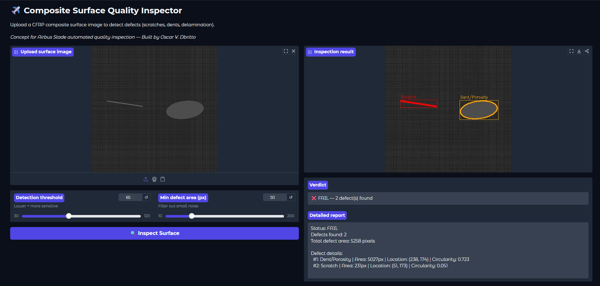

# Composite Surface Quality Inspector
 
screenshot_pass.png

 
## Overview
Computer vision system that detects surface defects on
CFRP composite parts: scratches, dents/porosity, and
delamination. Uses OpenCV image processing with
threshold-based detection and contour classification.
 
Concept for Airbus Stade automated quality inspection.
 
## Live Demo
**[Try it here](https://huggingface.co/spaces/Oscar0806/composite-vision-inspector)**
 
## How It Works
1. Image converted to grayscale
2. Gaussian blur applied to reduce noise
3. Binary thresholding isolates bright defects
4. Morphological operations clean the mask
5. Contour detection finds defect boundaries
6. Shape analysis classifies defect type:
   - High aspect ratio = Scratch
   - High circularity = Dent/Porosity
   - Low circularity = Delamination
7. PASS/FAIL decision based on defect count
 
## Defect Types Detected
| Defect | Detection Color | Shape Feature |
|--------|----------------|---------------|
| Scratch | Red | Aspect ratio > 4 |
| Dent/Porosity | Orange | Circularity > 0.6 |
| Delamination | Yellow | Irregular shape |
 
## Tech Stack (All Free)
- Python + OpenCV (image processing)
- Gradio (web interface)
- HuggingFace Spaces (deployment)
 
## Relevance to Airbus
- Airbus Acubed developed AVIA for visual inspection
- CTC uses optical scanning for composite repair
- Matches "Working Student Digitalization (AI)" role
 
## Author
**Oscar Vincent Dbritto**
M.Sc. Digitalization & Automation | [LinkedIn](https://linkedin.com/in/oscar-dbritto) | [Portfolio](https://oscardbritto.framer.website/)
